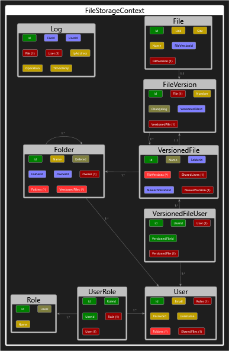

# File storage

This application was made as a part of the PV179 course (Development of systems in C#) at Faculty of Informatics, Masaryk University.  

The application uses 3 layer architecture (Data access layer, Business layer, Presentation layer) and showcases different design and programming patterns, such as Data Transfer Objects, Inversion of Control, Facade, Query Objects, Object Mapper, Service, Repository, Unit of Work.  

Used libraries include: Entity Framework Core, Autofac, AutoMapper, Serilog, NUnit.

## Model diagram
